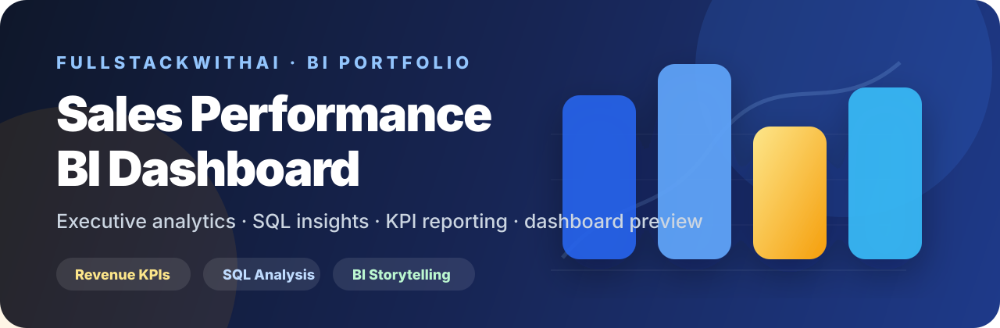

<div align="center">

# SALES PERFORMANCE BI DASHBOARD

### Executive Revenue Intelligence & Business Performance Analytics

**Revenue visibility. Regional performance. Customer segmentation. Decision-ready insight.**

[](https://www.designhubmk.com)


**Data to decisions. Revenue to insight. Dashboards to executive clarity.**

</div>

---

<p align="center">
  
</p>

## Executive BI Theme

This repository is presented as a complete **Executive Business Intelligence** case study. The goal is to show how raw sales activity can become KPI visibility, SQL-backed analysis, dashboard presentation, and stakeholder-ready recommendations.

| Theme Layer | Direction |
|---|---|
| **Design Identity** | Dark executive navy, blue analytics accents, gold KPI emphasis |
| **Product Feel** | Sophisticated BI dashboard / lightweight CRM reporting experience |
| **Audience** | Hiring managers, CEOs, analytics leads, BI teams, full-stack reviewers |
| **Core Message** | Business questions + SQL analysis + dashboard design + decision-ready insight |

---

## KPI Layer

| KPI | Value | Signal |
|---|---:|---|
| **Total Revenue** | **$2.4M** | Up 12% vs prior period |
| **Gross Profit** | **$890K** | Up 9% margin |
| **Average Order Value** | **$1,240** | Up $85 per order |
| **Top Region** | **West** | 38% of revenue |
| **Top Category** | **Software** | 44% of mix |

---

## Revenue by Region

| Region | Revenue | Visual Share |
|---|---:|---|
| **West** | **$912K** | ████████████████ 78% |
| **North East** | **$705K** | ████████████ 60% |
| **South** | **$516K** | █████████ 44% |
| **Midwest** | **$267K** | ██████ 30% |

---

## Business Questions Behind the Dashboard

| Executive Question | Why It Matters |
|---|---|
| **Which regions generate the most revenue?** | Supports market prioritization and regional investment decisions |
| **Which product categories are strongest?** | Identifies what deserves more sales and marketing attention |
| **Which customer segments are most valuable?** | Improves targeting, account strategy, and customer prioritization |
| **Which channels perform best?** | Guides direct, partner, and online sales decisions |
| **What trends deserve executive attention?** | Converts raw data into leadership-ready insight |

---

## What This Project Demonstrates

| Capability | Evidence in This Repo |
|---|---|
| **SQL Analysis** | Revenue, region, category, customer segment, and channel queries |
| **BI Thinking** | Executive questions, KPI design, and business recommendations |
| **Dashboard Design** | KPI cards, comparison bars, and insight-first presentation |
| **Data Storytelling** | Clear connection between numbers, business meaning, and action |
| **Frontend Execution** | Lightweight HTML/CSS/JS dashboard preview for visual presentation |
| **Portfolio Strategy** | A theme-matched project page that speaks to recruiters and decision-makers |

---

## Dashboard Preview

```bash
cd dashboard
python -m http.server 5173
```

Then open:

```text
http://localhost:5173
```

---

## Project Architecture

```text
sales-performance-bi-dashboard/
├── assets/
│   └── readme-banner.svg
├── data/
│   └── sample-sales-data.csv
├── sql/
│   └── sales-analysis.sql
├── dashboard/
│   ├── index.html
│   ├── styles.css
│   └── app.js
├── insights/
│   └── executive-summary.md
└── README.md
```

---

## Why This Repo Matters for Hiring Managers

- It starts with business questions, not random charts.
- It uses structured data and SQL logic.
- It presents KPIs in an executive-readable format.
- It includes a written insight layer, not only visuals.
- It connects analytics with frontend presentation.
- It shows the ability to turn data into a product-like reporting experience.

---

## Author

**Arsim Shefkiu**  
**AI Software Engineer · Full-Stack Developer · SaaS & Automation**

Founder of **DesignHubMK**, building AI-powered software, automation systems, and full-stack digital products.

[](https://www.designhubmk.com)
[](https://www.instagram.com/designhub_mk/)
[](https://github.com/fullstackwithai)

**Website:** https://www.designhubmk.com  
**Instagram:** @designhub_mk

---

<div align="center">

## Sales Performance BI Dashboard

**Data to decisions. Revenue to insight. Dashboards to executive clarity.**

Built by **Arsim Shefkiu · DesignHubMK**

</div>
