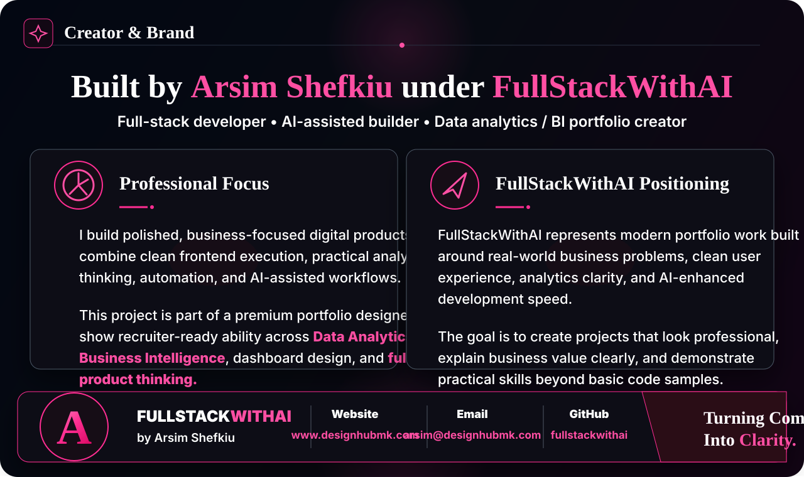

<p align="center">
  
</p>

<h1 align="center">Sales Performance BI Dashboard</h1>

<p align="center">
  <strong>Executive BI case study for revenue performance, regional growth, product-category intelligence, customer segmentation, and decision-ready sales insights.</strong>
</p>

<p align="center">
  
  
  
  
</p>

<p align="center">
  <a href="https://www.designhubmk.com"><strong>Portfolio</strong></a> ·
  <strong>arsim@designhubmk.com</strong> ·
  <a href="https://github.com/fullstackwithai"><strong>GitHub: fullstackwithai</strong></a>
</p>

---

## Executive Intelligence Snapshot

This repository is built like a stakeholder-facing **Business Intelligence case study**, not a basic code sample. It takes sales records and turns them into a clear reporting experience with KPIs, SQL queries, executive insights, and a lightweight dashboard preview.

The presentation is designed to show hiring managers, CEOs, and analytics leads that the work connects **data analysis, business context, dashboard design, and decision-making**.

| Business Lens | What the Dashboard Communicates |
|---|---|
| **Revenue Performance** | How total sales are moving across the sample business |
| **Regional Growth** | Which regions are producing stronger commercial outcomes |
| **Product Mix** | Which product categories contribute most to revenue |
| **Customer Segments** | Which customer types create the highest business value |
| **Sales Channels** | Where leadership should pay attention before investing more |

---

## The Business Questions Behind the Dashboard

A strong BI project starts with the questions leadership actually cares about:

| Executive Question | Why It Matters |
|---|---|
| Which regions generate the most revenue? | Supports market prioritization and regional investment decisions |
| Which product categories are strongest? | Helps identify what deserves more sales and marketing attention |
| Which customer segments are most valuable? | Improves targeting, account strategy, and customer prioritization |
| Which channels perform best? | Guides direct, partner, and online sales decisions |
| What trends deserve executive attention? | Converts raw data into leadership-ready insight |

---

## KPI Layer

| KPI | Business Purpose |
|---|---|
| **Total Revenue** | Measures overall commercial performance |
| **Gross Profit** | Shows revenue quality after estimated cost |
| **Average Order Value** | Reveals customer value per transaction |
| **Revenue by Region** | Compares geographic performance |
| **Revenue by Category** | Highlights product/category strength |
| **Channel Performance** | Compares direct, partner, and online sales contribution |

---

## What This Project Demonstrates

| Skill Area | Evidence in This Repo |
|---|---|
| **SQL Analysis** | Revenue, region, category, customer segment, and channel queries |
| **BI Thinking** | Executive questions, KPI design, and business recommendations |
| **Dashboard Design** | Clean KPI cards, comparison bars, and insight-first presentation |
| **Data Storytelling** | Clear connection between numbers, business meaning, and action |
| **Frontend Execution** | Lightweight HTML/CSS/JS dashboard preview for visual presentation |

---

## Dashboard Preview

The repo includes a lightweight visual dashboard preview that can be opened locally.

```bash
cd dashboard
python -m http.server 5173
```

Then open:

```text
http://localhost:5173
```

You can also open `dashboard/index.html` directly in your browser.

---

## Project Architecture

```text
sales-performance-bi-dashboard/
├── assets/
│   ├── readme-banner.svg
│   └── creator-brand-card.svg
├── data/
│   └── sample-sales-data.csv
├── sql/
│   └── sales-analysis.sql
├── dashboard/
│   ├── index.html
│   ├── styles.css
│   └── app.js
├── insights/
│   └── executive-summary.md
└── README.md
```

| File | Role in the BI Story |
|---|---|
| `data/sample-sales-data.csv` | Source dataset for the sales analysis case study |
| `sql/sales-analysis.sql` | SQL queries for revenue, region, category, segment, and channel views |
| `insights/executive-summary.md` | Executive summary and recommendations |
| `dashboard/index.html` | Visual dashboard experience |
| `dashboard/styles.css` | Executive BI styling and layout |
| `dashboard/app.js` | Simple data rendering for visual comparison bars |
| `assets/readme-banner.svg` | Theme-matched README hero banner |
| `assets/creator-brand-card.svg` | Premium Creator & Brand visual card |

---

## Why This Repo Matters for Hiring Managers

This project demonstrates the kind of thinking expected in real analytics and BI work:

- It starts with business questions, not random charts.
- It uses structured data and SQL logic.
- It presents KPIs in an executive-readable format.
- It includes a written insight layer, not only visuals.
- It connects analytics with frontend presentation.
- It shows the ability to turn data into a product-like reporting experience.

---

## Recommended Next Enhancements

- Add a Power BI or Tableau version of the dashboard
- Add a Python notebook for cleaning and exploratory analysis
- Add a larger synthetic dataset with more realistic order history
- Add interactive dashboard filters by region, category, and channel
- Deploy the dashboard preview with GitHub Pages
- Add live dashboard screenshots directly into the README

---

## Creator & Brand

<p align="center">
  <a href="https://www.designhubmk.com">
    
  </a>
</p>

<p align="center">
  <strong>Executive BI Theme:</strong> Data Analytics · Revenue Intelligence · SQL Analysis · KPI Dashboards · Business Storytelling
</p>

<p align="center">
  <a href="https://www.designhubmk.com"><strong>www.designhubmk.com</strong></a> · <strong>arsim@designhubmk.com</strong> · <a href="https://github.com/fullstackwithai"><strong>GitHub: fullstackwithai</strong></a>
</p>

<p align="center">
  <strong>FullStackWithAI</strong> — building premium dashboards and digital products that turn complexity into clarity.
</p>
